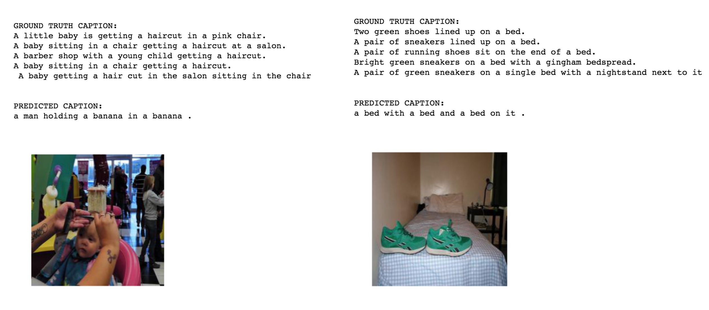

# Deep Learning Final Project

### Group member
- Ping Zhu     (pz2232)  
- Yang Hu      (yh2948)  
- Zhichao Yang (zy2280) 

### Environment & Dependencies
- **Environment:**
	- Python 3.5
	- Pytorch
	- Ubuntu 16.04.4 LTS
	- 4 core, 40G memory, with 4 GPUs
	- Install the cocoAPI from [pycocotools](https://github.com/cocodataset/cocoapi), and append it to your system path while running the code to generate captions vocabulary.

- **Follow the steps bellow to run the code**
	- Download the image from [this link](http://cocodataset.org/#download). We are using `2017 Val images [5K/1GB]` to train the data and do the validation over `2017 Test images [41K/6GB]`. 
	- Run `create_vocab_dic.py` to get a dictionary of all the vocabs appear more than five times in all of the captions. We will get a file `vocab.pkl` under the path `./data/vocab.pkl` by default.
	- Run `image_resize.py --image_dir path_to_your_image_file  --output path_to_save_image` to crop the image (255 x 255) to (224 x 224) to utilize the pretrained resnet152 model provided by the packet pytorchvision.
	- The `utils.py` has helper functions to transform the image and captions helpful to evaluate the model and transfer the images and captions.
	- The `data_loader.py` writes a wrapper over torch DataLoader to load coco dataset with COCO provied API. And it reformats the data per batch includes the merging captions, adds the padding, returns the caption length, etc.
	- You can load the pretrained model result from the directory `data\pretrained` model to directly test the result.
	- You can run the `view_data` to see the attention method used.
	- Run the jupyter notebook `main.ipynb` to train on the pretrained model or do everything from the scratch. Then you should see the loss and perplexity of the decoder printed.
	- You can do the prediction with `predit.ipynb`

### Performance 
    

|       |CIDEr | Bleu_1   | Bleu_2  |Bleu_3   |Bleu_4 | ROUGE_L| METEOR
| :---- | :-------: | :----------: |:-------: |:-------- :| :-------- :|: -------: |:------- :|
|  C5  |0.671694 |  0.661281 | 0.476947| 0.325450 | 0.216090| 0.481938| 0.212928|
|  C40 |0.704519 | 0.843240 | 0.724644 | 0.587346 | 0.452872 |0.610584| 0.282690|

- Some good result we get.

- Some bad result we get.

- Account and password for [coco evaluation](https://competitions.codalab.org/competitions/3221#participate-submit_results):
    - **Account name**:  matthew_zhu
    - **Password**:   fortune_teller_dl_final
- Evalutaion from COCO is saved in `eval_on_coco` directory.
- Prediction results on `val2014` and `test2014` are saved under `result` directory.

### Model Description 
Our model just exactly implements the [Kowning When to Look](https://arxiv.org/abs/1612.01887) model right now, we may add beam search to predict caption and use [Top Down](https://arxiv.org/abs/1707.07998) model to extract image feature later.

- **Encoder:**
	- Using Resnet 152 to extract the image features `V` and gets `v_g`, which later used to create `x_t` and feeds into LSTM.
- **Decoder:**
	- Embed the caption to get `w_t` and concate it with `v_g` to form `x_t`
	- Say the max length of all captions for current batch is #, Run the LSTM(RNN) # times, and store the hidden and cell states of all these timestamps. Meanwhile, extract the sentinal information from the LSTM.
	- Feed the hidden states, cell states and sentinal information to the attention block. From the attention block we can calculate the attention weights `α_t`, sentinal weight `β_t` and `c_hat`.
	- Feed the hidden state of LSTM and `c_hat` to MLP to get a score matrix `batch_size x # x len(vocab)`, where each row denotes a slot in the caption output and each column represents a word in the dictionary. We select the word with hightest score for each caption slot and form the final caption.(Greedy)

### Reference

- [ruotianluo/ImageCaptioning.pytorch](https://github.com/ruotianluo/ImageCaptioning.pytorch)
- [yufengm/Adaptive](https://github.com/yufengm/Adaptive)
- [Kowning When to Look](https://arxiv.org/abs/1612.01887)